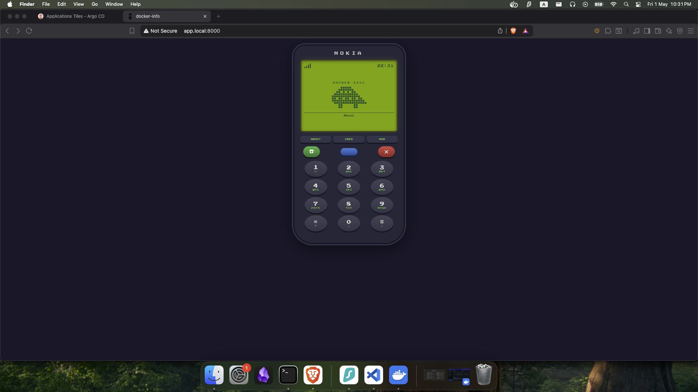
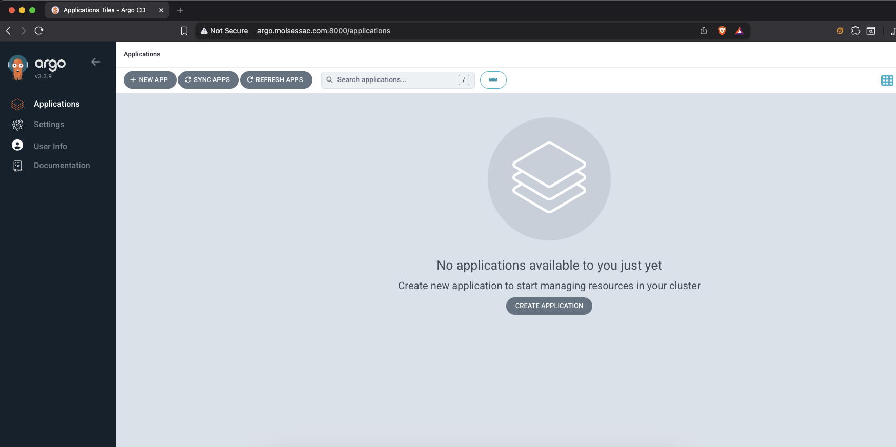

# Assignment 08 — Kubernetes Cluster con Minikube, ArgoCD y Traefik

## Descripción

Despliegue de un clúster local de Kubernetes usando Minikube, con ArgoCD como gestor de aplicaciones, Traefik como controlador de ingress/rutas, y la aplicación de la semana 4 (`assignment-04`) expuesta mediante un dominio local personalizado.

---

## Capturas de pantalla

### Aplicación `assignment-04` — `http://app.local:8000`



### ArgoCD — `http://argo.moisessac.com:8000`



### Configuración DNS local (`/etc/hosts`)


---

## Configuración DNS local

Para que Traefik pueda resolver los dominios localmente, se agregaron las siguientes entradas al archivo `/etc/hosts`:

```
127.0.0.1 app.local
127.0.0.1 argo.moisessac.com
```

---

## Manifiestos de las aplicaciones

### `k8s/namespace.yaml`
```yaml
apiVersion: v1
kind: Namespace
metadata:
  name: app
```

### `k8s/deployment.yaml`
```yaml
apiVersion: apps/v1
kind: Deployment
metadata:
  name: assignment-04
  namespace: app
spec:
  replicas: 2
  selector:
    matchLabels:
      app: assignment-04
  template:
    metadata:
      labels:
        app: assignment-04
    spec:
      containers:
      - name: assignment-04
        image: moisesac/assignment-04:latest
        ports:
        - containerPort: 80
        imagePullPolicy: Always
```

### `k8s/service.yaml`
```yaml
apiVersion: v1
kind: Service
metadata:
  name: assignment-04
  namespace: app
spec:
  selector:
    app: assignment-04
  ports:
  - port: 80
    targetPort: 80
  type: ClusterIP
```

### `k8s/ingressroute.yaml`
```yaml
apiVersion: traefik.io/v1alpha1
kind: IngressRoute
metadata:
  name: assignment-04
  namespace: app
spec:
  entryPoints:
    - web
  routes:
    - match: Host(`app.local`)
      kind: Rule
      services:
        - name: assignment-04
          port: 80
```

### `k8s/argocd-servers-transport.yaml`
```yaml
apiVersion: traefik.io/v1alpha1
kind: ServersTransport
metadata:
  name: argocd-insecure-transport
  namespace: argocd
spec:
  insecureSkipVerify: true
```

### `k8s/argocd-ingressroute.yaml`
```yaml
apiVersion: traefik.io/v1alpha1
kind: IngressRoute
metadata:
  name: argocd-ingressroute
  namespace: argocd
spec:
  entryPoints:
    - web
  routes:
    - match: Host(`argo.moisessac.com`)
      kind: Rule
      services:
        - name: argocd-server
          port: 80
          scheme: http
          serversTransport: argocd-insecure-transport
```

### `traefik-values.yaml`
```yaml
service:
  type: LoadBalancer
ports:
  web:
    port: 80
  websecure:
    port: 443
```

---

## Lista de comandos ejecutados

### 1. Iniciar Minikube
```bash
minikube start --kubernetes-version=v1.28.0
```

### 2. Instalar ArgoCD
```bash
kubectl create namespace argocd
kubectl apply -n argocd -f \
  https://raw.githubusercontent.com/argoproj/argo-cd/stable/manifests/install.yaml
```

### 3. Parchear ArgoCD para modo insecure (permite HTTP a través de Traefik)
```bash
kubectl wait --for=condition=available deployment/argocd-server -n argocd --timeout=120s
kubectl patch deployment argocd-server -n argocd \
  --type='json' \
  -p='[{"op":"add","path":"/spec/template/spec/containers/0/args/-","value":"--insecure"}]'
```

### 4. Instalar Traefik con Helm
```bash
helm repo add traefik https://traefik.github.io/charts
helm repo update
helm upgrade --install traefik traefik/traefik -n traefik --create-namespace \
  -f traefik-values.yaml
```

### 5. Aplicar manifiestos de Kubernetes
```bash
kubectl apply -f k8s/
```

### 6. Configurar DNS local
Agregar al archivo `/etc/hosts`:
```
127.0.0.1 app.local
127.0.0.1 argo.moisessac.com
```

### 7. Exponer Traefik mediante port-forward 
```bash
kubectl port-forward svc/traefik -n traefik 8000:80
```
---

## Acceso a las aplicaciones

| Aplicación | URL |
|---|---|
| Assignment-04 | http://app.local:8000 |
| ArgoCD | http://argo.moisessac.com:8000 |

> **Nota:** El port-forward debe estar activo para acceder a ambas URLs. Solo se necesita **una terminal** con el port-forward corriendo — Traefik enruta ambos dominios por hostname.

---

## Script de instalación automatizada

El archivo `install.sh` automatiza todos los pasos anteriores:

```bash
bash install.sh
```

> Después de ejecutar el script, iniciar el port-forward en una segunda terminal:
> ```bash
> kubectl port-forward svc/traefik -n traefik 8000:80
> ```