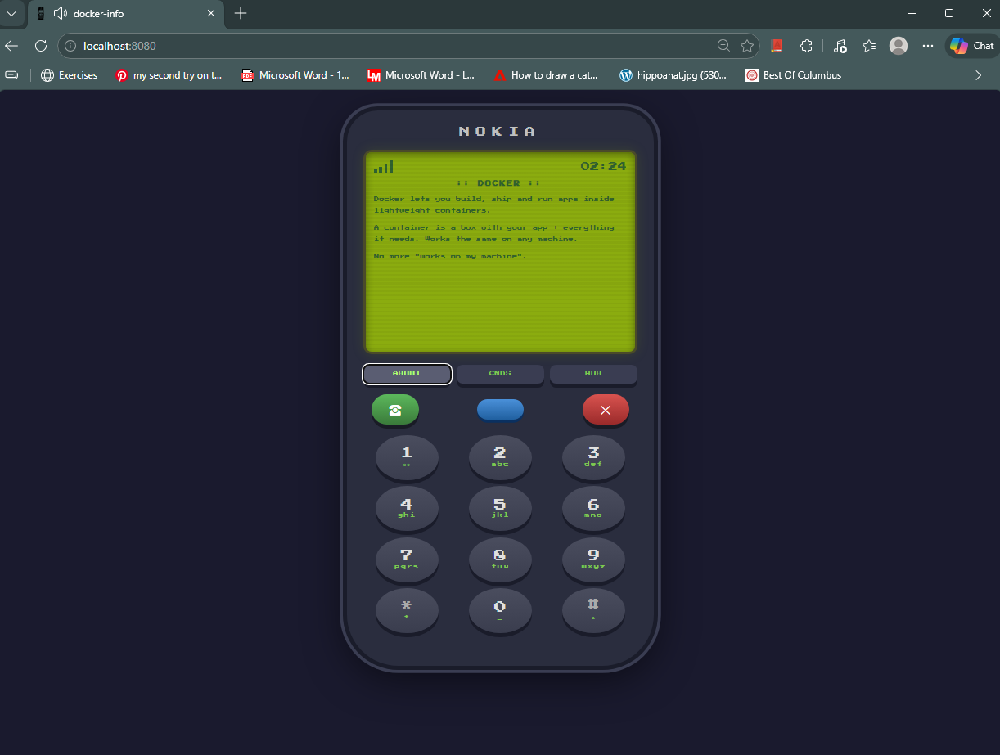
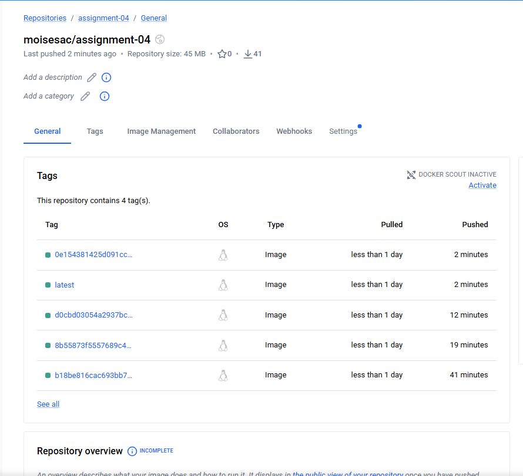

# Assignment 04

## Aplicación



## ¿Qué se hizo en esta tarea?

### 1. Dockerización de la aplicación
Se creó un `Dockerfile` con una estrategia de **multi-stage build**:
- **Etapa 1 (builder):** Usa Node.js para compilar el proyecto con Vite
- **Etapa 2 (production):** Usa nginx para servir los archivos estáticos

Las imágenes y herramientas están fijadas a versiones específicas para garantizar reproducibilidad:
- `node:20.19.0-alpine3.21`
- `pnpm:10.17.1`
- `nginx:1.27.4-alpine`

### 2. Gestión de secretos con Doppler
Las credenciales de Docker Hub se almacenaron en **Doppler** y se sincronizaron
automáticamente como secrets en GitHub Actions.

### 3. Pipeline CI/CD con GitHub Actions
Se configuró un pipeline que se ejecuta automáticamente en cada `push` a la rama
`assignment-04` y realiza las siguientes acciones:
- Build de la imagen Docker
- Push a Docker Hub con dos tags:
  - `latest` → siempre apunta a la imagen más reciente
  - `SHA del commit` → permite identificar exactamente qué código contiene cada imagen

## Docker Hub

**URL de la imagen:** `https://hub.docker.com/r/moisesac/assignment-04`

Para correr la imagen localmente:

```bash
docker pull moisesac/assignment-04:latest
docker run -p 8080:80 moisesac/assignment-04:latest
```

Luego debe abrir `http://localhost:8080` en su navegador.

## Tags en Docker Hub


