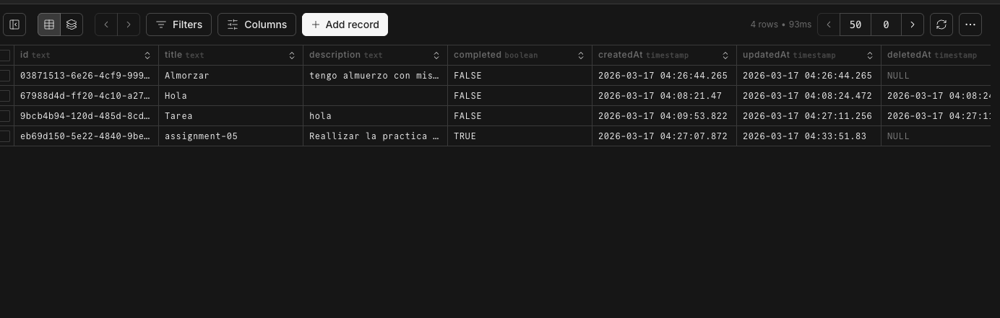

# Todo App

Aplicación web de gestión de tareas (Todo App) construida como monorepo
con Turborepo, Next.js, Express y PostgreSQL.

## URLs

- **Frontend:** https://todo-app-nine-ashen-68.vercel.app/
- **Backend:** https://todo-api-x90t.onrender.com
- **API Docs (Swagger):** https://todo-api-x90t.onrender.com/api/docs

## Stack

| Capa | Tecnología |
|---|---|
| Frontend | Next.js + Tailwind CSS |
| Backend | Express + TypeScript |
| Base de datos | PostgreSQL (Neon) |
| ORM | Prisma v6 |
| Monorepo | Turborepo + pnpm workspaces |
| Secretos | Doppler |
| Deploy Frontend | Vercel |
| Deploy Backend | Render |

## Estructura del proyecto

```text
├── apps/
│   ├── web/          # Frontend Next.js
│   └── api/          # Backend Express
│       └── prisma/
│           ├── schema.prisma
│           └── migrations/
├── turbo.json
└── pnpm-workspace.yaml
```

## Base de datos

### Schema (Prisma)

```prisma
model Task {
  id          Int      @id @default(autoincrement())
  title       String
  description String?
  completed   Boolean  @default(false)
  createdAt   DateTime @default(now())
  updatedAt   DateTime @updatedAt
}
```

### Screenshot de la base de datos en Neon



## API Endpoints

| Método | Ruta | Descripción |
|---|---|---|
| GET | /api/tasks | Obtener todas las tareas |
| POST | /api/tasks | Crear una tarea |
| PATCH | /api/tasks/:id | Actualizar una tarea |
| DELETE | /api/tasks/:id | Eliminar una tarea |

> Documentación completa disponible en `/api/docs`

## Variables de entorno

Manejadas con **Doppler** en el ambiente `prd`.

### Backend (Render)
```text
DATABASE_URL
PORT
API_URL
```

### Frontend (Vercel)
```text
NEXT_PUBLIC_API_URL
```
